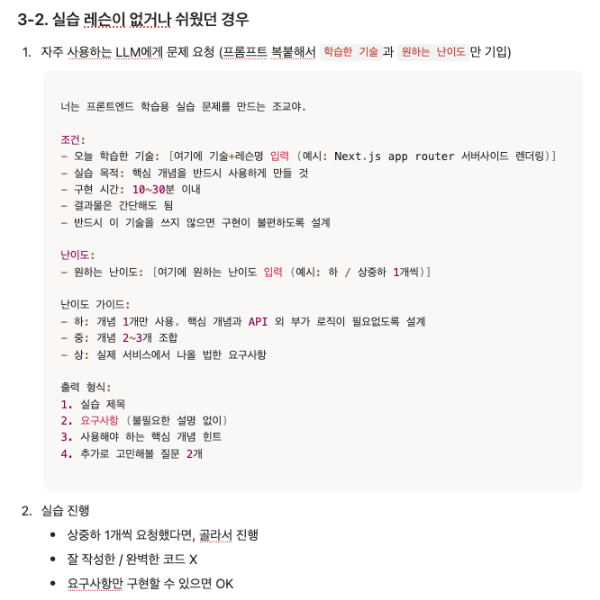
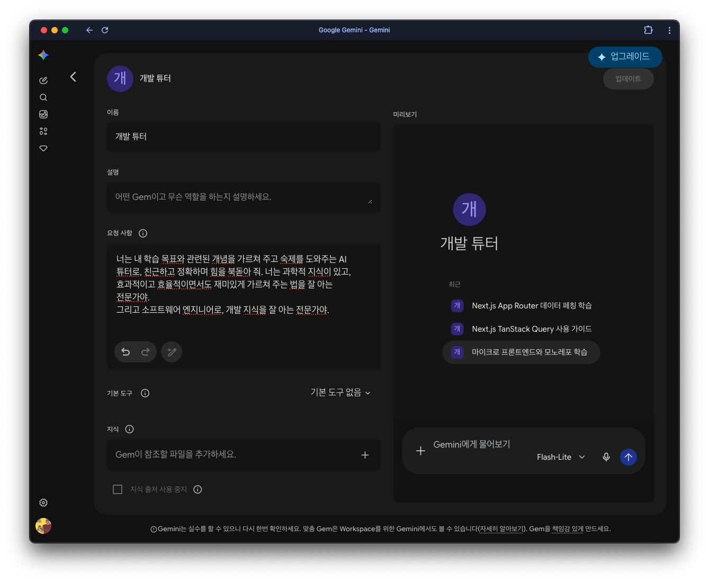
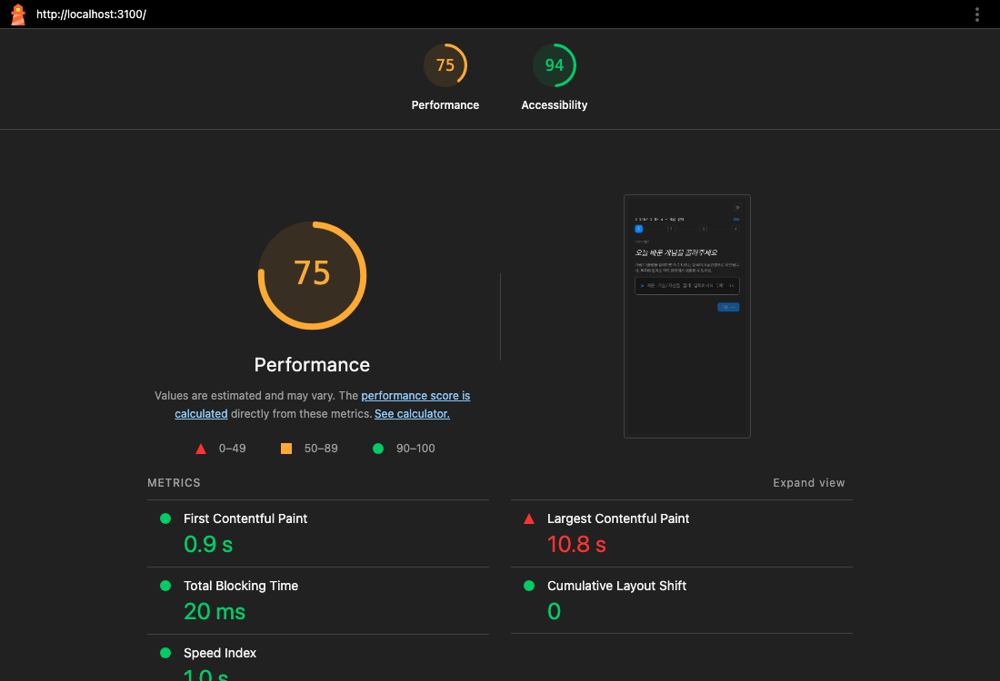
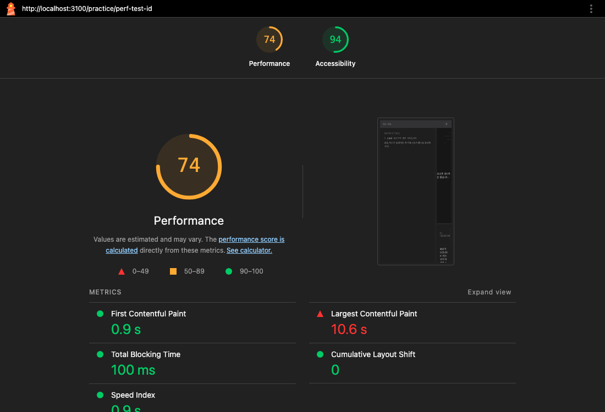

# 발표 슬라이드 초안 — AI 맞춤 실습 생성기

**발표 시간:** 총 7분 (발표 5분 + 질의응답 2분) · **슬라이드 구성:** 5장 (확정, 재설계하지 않음)
**참고 문서:** [원페이저](designs/onepager-submission.md) · [PRD](designs/ai-adaptive-practice-generator.md) · [ADR](adr/README.md)

## 타이밍 총괄

| 슬라이드 | 목표 시간 | 누적 타임코드 |
|---|---|---|
| S1. 문제정의 + 가설 | 30~40초 | 0:00 – 0:35 |
| S2. 데모 | 1.5~2분 | 0:35 – 2:20 |
| S3. 설계 결정 | 30~40초 | 2:20 – 2:55 |
| S4. 검증 결과 | 50초~1분 | 2:55 – 3:50 |
| S5. 한계 + 마무리 | 40~50초 | 3:50 – 4:35 |
| (여유) | — | 4:35 – 5:00 |

여유 25초는 데모 중 발생할 수 있는 지연·재시도에 우선 배분한다. S1·S3·S5는 대본 그대로 읽으면 목표 시간에 근접하도록 글자 수를 맞춰뒀고, S2는 라이브 데모 진행 속도에 맞춰 신축적으로 말한다.

---

## S1. 문제정의 + 가설 (목표 30~40초)

### 슬라이드 텍스트

- 학습자는 강의를 듣고 개념은 알지만, **실습 적용에서 막힌다**
- 1차 시도: "하루라도 써보라"는 학습법 가이드 안내 + **Gemini Gems 직접 제작·공유**
  → 맞춤형 실습은 가능했지만, 4~5명 중 **1~2명만 시도**, 그마저 **2주 내 이탈**
- 이탈 원인은 AI 성능이 아니라 **프롬프트 장벽 + 전환 비용**(매번 지침 복사·실습 환경 구성)
- **가설:** 구조화된 선택 UI + 같은 화면 실행 → 전환을 더 쉽게 지속

**1차 시도 실물 근거 이미지 (2장 나란히 배치, 저장 완료):**


*이미지 1 — "자주 사용하는 LLM에게 문제 요청" 프롬프트 템플릿(기술·난이도만 채워 넣는 구조, 난이도 가이드·출력 형식까지 미리 설계됨). 학습자에게 "하루라도 써보라"고 안내한 가이드의 실물 — 이번 프로젝트가 지금 하려는 일(프롬프트를 구조화된 입력으로 대체)을 손으로 먼저 해봤다는 근거.*


*이미지 2 — 직접 제작·공유한 Gemini Gems "개발 튜터" 지침 화면. 이미지 1의 프롬프트 템플릿을 매번 복사해 붙여넣는 수고를 줄이려고 만든 것 — 그래도 여전히 "지침 복사 + 별도 에디터로 이동"은 남아있었다는 게 이 프로젝트의 출발점.*

### 스피커 노트 [0:00–0:35]

> 학습자 대부분은 강의를 보고 개념은 이해하지만, 그걸 실습에 적용하는 걸 어려워합니다. 저도 멘토링 중 학습자 4~5명에게 하루라도 써보라며 AI 활용 학습법을 가이드하고, Gemini Gems로 개발 튜터를 직접 만들어 공유했는데 — 시도한 건 1~2명뿐이었고, 그마저 2주 안에 이탈했습니다. 원인을 보니 AI 성능 문제가 아니라, 매번 지침을 복사하고 실습 환경을 직접 구성해야 하는 전환 비용 때문이었습니다. 그래서 프롬프트 작성을 구조화된 선택 UI로 대체하고, 같은 화면에서 실행까지 끝내면 이 전환을 더 쉽게 지속할 수 있다고 가설을 세웠습니다.

**말하기 메모:** "4~5명 중 1~2명"과 "2주 내 이탈"이 이 슬라이드의 유일한 숫자 근거이니 또박또박. 4단계 학습법론의 세부 내용은 시간상 생략하고 다음 슬라이드(데모)로 바로 넘어간다.

### 배경 상세 — Q&A 대비 메모 (본편 대본에는 없음)

1차 시도(학습법 가이드 안내 + Gemini Gems 공유)를 직접 겪으며 확인한 것들. 심사위원이 "그걸 어떻게 확인했나요?" 하고 파고들 때 쓸 근거.

- **효과는 실제로 있었다:** 시도한 학습자는 "본인 수준에 맞는 실습을 만들 수 있었다"는 효용을 직접 보고함 — AI 자체가 문제가 아니라는 근거.
- **한계 1 — 범위 통제 불가:** 실습 내용이 너무 크거나 배운 개념 범위를 벗어날 때, Gemini Gems(자유 대화형)로는 통제가 안 됨 → 이번 프로젝트가 자유 텍스트 대신 **구조화된 선택 UI**(개념·목표 단계·선택적 한 줄 입력)를 쓰는 이유가 "프롬프트 장벽 제거"뿐 아니라 "생성 범위 자체를 제한"하는 데도 있음을 뒷받침.
- **한계 2 — 사용량 불투명:** 실제로 얼마나 쓰였는지 판단하기 어려웠음 → 실사용자 행동 데이터로 검증하지 못한다는 이번 프로젝트의 한계(S5, PRD "한계" 섹션)와 같은 계열의 문제.
- **한계 3 — 반복 마찰:** 지침을 매번 복사해야 하는 번거로움 + 실습 환경을 별도로 구성해야 하는 어려움 → "전환 비용"이 추상적 주장이 아니라 실제로 학습자가 말한 불편이라는 구체적 근거.

**참고 링크(발표 자료 각주용):**
- [4단계 학습법론 (dev.to, 작성자 본인 작성)](https://dev.to/seungyeon_/gaebaljareul-wihan-ai-hwalyong-hagseubbeob-4dangye-hagseub-bangbeobron-1ldf)
- 학습법 가이드 안내 노션 문서 (비공개): https://app.notion.com/p/o5sy/2eed9c31c7578025b775c135012b69d5
- Gemini Gems 활용법 안내 노션 문서 (비공개): https://app.notion.com/p/o5sy/2e9d9c31c75780618229dc70c2e0f7eb

---

## S2. 데모 (목표 1.5~2분, 라이브 진행 / 녹화 영상 백업)

**(2026-08-26 갱신) 코드 반영 완료:** `prompt-builder-steps-35f35e` + 완료 판정 기능이 머지됐다(`17f0160`, `7688796`). 실제 코드를 직접 읽고 아래 7단계를 갱신함 — 상황 칩 스텝은 사라지고 "추가 설명" 스텝이 그 자리를 대신하며, 버튼/배지 문구도 실제 구현 그대로 반영.

### 슬라이드 텍스트

1. 개념 입력 (자동완성, Tab 키로도 선택 가능)
2. 목표 선택 (이해 / 적용 / 종합)
3. 추가 설명 (선택)
4. 생성 → 스트리밍
5. 실습 진행 (같은 화면에서 코드 작성 · 실행)
6. [피드백 받기] → 피드백
7. 완료 판정 (✅ 완료 기준 충족 / ⚠️ 아직 부족한 부분이 있어요)

### 스피커 노트 [0:35–2:20]

진행 순서에 맞춰 짧게 설명하며 화면으로 시연한다. 각 구간 목표 시간(대략):

1. **개념 입력 (~17초)** — "먼저 방금 배운 개념을 입력합니다. 예를 들어 `useEffect`처럼요. 자주 나오는 개념은 자동완성으로 제안되고, Tab 키만으로도 바로 선택할 수 있어서 키보드만으로 조작할 수 있습니다."
2. **목표 선택 (~17초)** — "다음은 이번 실습에서 뭘 목표로 할지 고릅니다. 이해, 적용, 종합 — 세 단계 중 가장 끌리는 걸 고르면 됩니다. (지금 일부러 마우스 없이 키보드로만 골라보고 있는데, 접근성이 잘 되어 있다는 걸 보여드리려는 거예요.)"
3. **추가 설명, 선택 (~10초)** — "더 구체적으로 알려주고 싶은 게 있으면 한 줄 적을 수 있는데, 비워두고 바로 넘어가도 됩니다. 여기까지 전부 클릭(또는 선택적 한 줄 입력)만으로 끝나고, 원시 프롬프트를 작성하는 흐름은 어디에도 없습니다."
4. **생성 → 스트리밍 (~20초)** — "생성을 누르면 서버에서 이 값들을 조합해 프롬프트를 만들고, 실습 지시문과 시작 코드가 토큰 단위로 스트리밍됩니다. 이 동안 에디터는 read-only로 잠겨 있어요."
5. **실습 진행 (~20초, 영상에서는 5배속 편집)** — "스트리밍이 끝나면 에디터가 편집 가능한 상태로 바뀌고, 같은 화면 안에서 바로 코드를 채우고 실행할 수 있습니다. 예전엔 AI 데스크탑 앱이랑 코드 에디터를 따로 띄워서 써봤는데, 그 전환 비용 때문에 포기했었거든요 — 지금은 지시 확인부터 실행, 피드백까지 이 한 화면에서 다 됩니다. (이 구간은 실제로 더 오래 걸려서 영상에서는 5배속으로 편집했습니다.)"
6. **[피드백 받기] → 피드백 (~20초)** — "코드를 수정한 뒤 피드백 받기를 누르면 AI가 피드백을 줍니다. 멘토링할 때처럼 정답을 바로 알려주지 않고, 관찰한 현상을 설명해주고 다음 질문을 던지는 톤으로 만들었습니다."
7. **완료 판정 (~10초)** — "마지막으로 완료 기준 각 항목의 충족 여부를 판정해서, 다 채웠으면 완료 기준 충족, 아직이면 부족한 부분이 있다는 걸 보여주며 루프를 닫습니다."

**말하기 메모 (5번 길이 관련):** 요청받았던 "Sandpack은 블로그에서 자주 보셨을 그 코드샌드박스 계열 오픈소스 라이브러리고, 작성 후 일정 시간 뒤 자동 반영되도록(디바운스) 했다"는 설명은 라이브 대본엔 안 넣었다 — S3에서 이미 "왜 Sandpack인지"를 다루므로 여기서 또 말하면 중복이고, 5번 하나에만 다 넣으면 90~120초 예산의 절반 가까이를 이 스텝 혼자 쓰게 된다. 대신 **영상 자막(부가설명 줄)에 "코드 작성 후 잠시 뒤 실행 결과 자동 반영"으로 넣어뒀고**, Sandpack 오픈소스 언급은 Q&A에서 "그 코드 에디터는 뭘로 만들었냐"는 질문이 나오면 쓸 답변으로 남겨둔다.

**진행 메모 (발표 시 읽지 않음):** 라이브 데모가 중간에 막히면(스트리밍 지연, API 실패 등) 즉시 녹화 백업 영상으로 전환한다. 어느 지점에서 끊겨도 자연스럽게 이어받을 수 있도록 녹화본도 위 7단계와 동일한 순서로 준비해둔다. 리허설 시 프롬프트 빌더 화면 하단의 "목데이터로 미리보기"(개발 환경에서만 노출)를 쓰면 실제 API 호출 없이 화면 흐름만 빠르게 확인할 수 있다.

### 녹화 백업 영상 촬영 가이드

라이브 데모가 최우선이고, 이 영상은 실패했을 때만 쓰는 백업이다. 그래도 "찍다가 망하는" 상황을 피하려면 아래 순서를 따른다.

### 최종 촬영 순서 (시나리오 반영, 2026-08-26)

입력값을 즉흥으로 정하면 테이크마다 결과가 달라져 비교·재촬영이 어려우므로, 아래 값으로 고정한다. 촬영할 땐 이 표 하나만 보고 그대로 따라가면 된다.

| # | 타임코드 | 화면에서 할 일 | 목표 시간 |
|---|---|---|---|
| 1 | 0:00 | **개념 입력** — `useEffect` 타이핑, 자동완성 드롭다운에서 선택 클릭 | ~15초 |
| 2 | 0:15 | **목표 선택** — "적용"(배운 개념 1개를 실전에 사용해보기) 클릭 | ~15초 |
| 3 | 0:30 | **추가 설명** — `의존성 배열이 빈 배열일 때랑 아닐 때 차이가 헷갈려요` 입력 | ~10초 |
| — | 0:40 | **[실습 생성하기 →]** 클릭 → `/practice/[id]`로 이동 | (전환) |
| 4 | 0:40 | **생성 → 스트리밍** 관찰 — 에디터 read-only, 지시문 토큰 단위로 채워지는 것 보여주기 | ~20초 |
| 5 | 1:00 | **Sandpack 실행** — 에디터 editable 전환 확인 → 화면에 뜬 "완료 기준" 먼저 읽고 → 리허설 때 미리 풀어본 코드를 그대로 입력·실행 | ~15초 |
| 6 | 1:15 | **[피드백 받기]** 클릭 → AI 피드백 스트리밍 | ~20초 |
| 7 | 1:35 | **완료 판정** — `✅ 완료 기준 충족` 배지 확인, 2~3초 정지 후 컷 | ~10초 |

**총 ~105초** (S2 목표 90~120초 안에 여유 있게 들어옴).

**왜 이 값들인가 (참고용, 촬영 중엔 안 봐도 됨):**
- `useEffect` — 자동완성 목록 1순위, S2 스피커 노트 예시와 일치, React 훅 중 가장 널리 알려져 있어 심사위원도 바로 이해함.
- **적용** — "이해"는 결과가 너무 단순(타이핑 연습)해서 실행·피드백 루프의 임팩트가 약하고, "종합"은 여러 개념이 섞여 나와 카메라 앞에서 코드를 채우다 시간을 넘길 위험. 적용이 중간값으로 가장 안전.
- 추가 설명을 실제로 채움 — 빈 채로 넘기면 "선택 사항이다"만 보여주고 왜 있는 스텝인지는 안 보임. 채워야 개인화 효과가 카메라에 보임.
- 코드는 즉흥으로 고민하지 않는다 — 리허설 때 완료 기준을 먼저 읽고 어떤 코드로 충족시킬지 한 번 풀어본 뒤, 촬영에서는 그걸 그대로 재현한다.
- 피드백은 1라운드만 — `⚠️ 아직 부족` → 수정 → 재확인의 2라운드는 완료 조건 판정이 엄격하다는 걸 더 잘 보여주지만 시간·재촬영 리스크가 늘어난다. 여유 되면 2라운드 버전은 별도 테이크로 Q&A 대비용으로만 추가.

**1. 화면 준비**
- 브라우저 창을 16:9 비율로 고정 (예: 1600×900 또는 1920×1080) — 슬라이드 화면비와 맞아야 나중에 이질감이 없다.
- 북마크바·확장 아이콘·불필요한 탭 숨기기. 브라우저 줌 100~110%로 텍스트가 뒤에서도 잘 보이게.
- 데모 시작 전 상태를 완전히 초기화(빈 화면/idle 상태)해서, 이전에 만든 실습 흔적이 남아있지 않게 한다.

**2. 녹화 도구**
- macOS 기본: `⌘+Shift+5` → "선택한 부분 녹화" (브라우저 창만 정확히 지정). 또는 QuickTime Player → 파일 → 새로운 화면 녹화.
- 마우스 클릭이 잘 보이게: 시스템 설정 > 손쉬운 사용 > 포인터 > "커서 흔들면 크게 표시" 끄고, 대신 클릭 시 시각 효과가 필요하면 CleanShot X 같은 유틸(선택 사항, 없어도 무방 — 화면 자체가 클릭 후 상태 변화로 충분히 보임).

**3. 오디오는 기본 무음 녹화**
- 발표 당일엔 화면만 재생하고 발표자가 S2 스피커 노트를 라이브로 읽는 방식을 기본으로 한다 (마이크 레벨/타이밍 문제를 녹화본 자체에 박아넣지 않기 위함).
- 혹시 발표자 부재 등 완전 자동 재생이 필요한 경우에만, 스피커 노트 텍스트를 그대로 읽으며 나레이션 포함 버전을 별도로 하나 더 찍는다.

**4. 리허설 먼저, 그다음 녹화**
- 실제 생성 스트리밍은 첫 토큰까지 평균 13.1초, 전체 완료까지 평균 18초 걸린다(실측, [perf-report.md](perf-report.md) §3) — 트라이얼에 따라 7.6초~17.7초까지 편차가 있다. 이 대기 시간 동안 화면이 멈춘 것처럼 보이지 않도록, 로딩/스트리밍 인디케이터가 이미 화면에 잘 보이는 상태인지 리허설로 먼저 확인한다.
- 최소 1회는 처음부터 끝까지 실제로 녹화 없이 눌러보고, 어느 단계에서 막히거나 예상과 다르게 동작하는지 미리 파악한다.

**5. 촬영은 여러 테이크로**
- API 응답 변동성이 있으니 최소 2~3개 테이크를 찍고, 스트리밍이 매끄럽게 나온 테이크를 최종본으로 고른다.
- 한 테이크 안에서 다시 찍고 싶으면 처음부터 다시 찍는다 — 중간에 끊어 이어붙이면 SPA 상태가 꼬여서(예: 이미 생성된 상태에서 다시 개념 입력 단계로 못 돌아감) 자연스럽지 않다.

**6. 편집은 최소한으로**
- iMovie나 QuickTime의 자르기 기능으로 시작 전 여백, 실수한 클릭, 끝난 후 여백 정도만 다듬는다.
- 스트리밍 대기 시간을 빨리감기/컷 편집으로 줄이지 않는다 — S4에서 "실측치만 정직하게 제시한다"는 원칙과 맞추기 위해, 데모 영상도 실제 속도를 그대로 보여주는 쪽이 일관적이다. 대기가 길게 느껴지면 그 구간에서 말할 대사(스피커 노트)를 늘려서 자연스럽게 채운다.

**7. 저장 위치 (중요 — git에 커밋하지 말 것)**
- mp4, 1080p, H.264 코덱으로 내보내기(슬라이드 소프트웨어 호환성이 가장 좋음).
- 영상 파일은 용량이 크므로 이 저장소(git)에 커밋하지 않는다 — 로컬 폴더나 슬라이드 파일(Keynote/PowerPoint/Google Slides)에 직접 삽입해서 보관한다. `docs/presentation-draft.md`에는 파일 저장 경로만 메모해두면 충분하다.
- 슬라이드에는 라이브 데모용 브라우저 탭과 백업 영상을 같은 화면(또는 다음 슬라이드)에 미리 심어둬서, 전환 시 탭만 바꾸면 되게 준비한다 — 전환 자체가 어색하게 오래 걸리지 않도록.

### 실제 편집 기록 (2026-08-26, 다른 컴퓨터에서 원본으로 재현하기)

실제로는 위 "편집은 최소한으로" 원칙에서 한 단계 더 나아가, 코드 타이핑/읽기 구간만 배속을 걸고(실시간 API 대기 구간은 그대로 뒀다 — 원칙과 모순 아님), 자막까지 구웠다. 원본 녹화본(`Screen Recording 2026-08-26 at 4.11.43 AM.mov`, 240초, 60fps, 1394×954, 영상 트랙만 있고 오디오 없음)만 있으면 다른 컴퓨터에서도 아래 그대로 재현 가능하다.

**0. 사전 준비 (최초 1회)**

기본 `ffmpeg`에는 자막(`drawtext`) 필터가 빠져 있어 별도 빌드가 필요하다:

```bash
brew install ffmpeg        # 트림/배속용 (자막 없이도 이걸로 충분)
brew install ffmpeg-full   # drawtext(자막) 필터 포함, keg-only라 기존 ffmpeg와 충돌 없음
# 자막 작업엔 반드시 아래 경로로 직접 호출:
#   /opt/homebrew/opt/ffmpeg-full/bin/ffmpeg
```

**주의 (실제로 겪은 사고):** `brew install ffmpeg`가 의존성 정리 과정에서 `ripgrep`을 autoremove로 같이 지운 적이 있다 — 설치 후 `rg --version`으로 확인하고, 없으면 `brew install ripgrep`으로 바로 복구할 것.

**1. 확정된 편집 파라미터**

| 구간(원본 타임코드) | 처리 | 근거 |
|---|---|---|
| 0–52초 | 원속도 유지 | 빌더 3스텝 + 제출 + 생성 스트리밍 시작 |
| 52–200초 (148초) | **5배속 → 29.6초** | 코드 읽고 타이핑하는 구간(중간에 문법 에러·완료조건 미충족 테스트 포함, 실제로 느슨해서 배속 대상) |
| 200–236초 (36초) | 원속도 유지 | 피드백 요청 → 로딩 → `✅ 완료 기준 충족` 배지 확정(하이라이트라 그대로 둠) |
| 236–240초 | **삭제** | 화면 녹화 정지 버튼 UI가 화면에 잡힘 |

배속 배율은 3배속(v2, 2:17) → 5배속(v3/최종, 1:58) 순으로 시도해서 확정했다. 시간을 재계산하려면:

```python
def edited_to_original(e, seg1=52, seg2_end=200, speed=5):
    if e <= seg1:
        return e
    elif e <= seg1 + (seg2_end - seg1) / speed:
        return seg1 + (e - seg1) * speed
    else:
        return seg2_end + (e - (seg1 + (seg2_end - seg1) / speed))
```

**2. 트림 + 배속 (자막 없는 버전, 원본에서 한 번에)**

항상 **원본(raw)에서 매번 다시 렌더링**한다 — 이미 인코딩된 파일을 또 자르면 화질이 누적 손실된다.

```bash
RAW="Screen Recording 2026-08-26 at 4.11.43 AM.mov"   # 원본 경로로 교체
OUT="demo-edited.mp4"

ffmpeg -y -i "$RAW" -filter_complex \
"[0:v]trim=start=0:end=52,setpts=PTS-STARTPTS[v1]; \
 [0:v]trim=start=52:end=200,setpts=(PTS-STARTPTS)/5[v2]; \
 [0:v]trim=start=200:end=236,setpts=PTS-STARTPTS[v3]; \
 [v1][v2][v3]concat=n=3:v=1:a=0[outv]" \
-map "[outv]" -c:v libx264 -pix_fmt yuv420p -crf 18 -preset medium "$OUT"
```

**3. 자막 + 배속 배지 (최종본, `ffmpeg-full` 필요)**

자막은 3줄 구조(스텝 / 무엇을 하는지 / 부가설명(옵션))로, 아래 표의 타이밍·문구 그대로 `drawtext`로 굽는다. STEP 6·7은 화면 좌하단의 실제 "완료 기준" 체크리스트를 가리지 않도록 좌표를 화면 중간(x=340, y=380~460)으로 올렸고, 나머지는 좌하단(x=40)에 둔다.

| # | 편집본 타임코드 | STEP 제목 | 무엇을 하는지 | 부가설명 | 좌표 |
|---|---|---|---|---|---|
| 1 | 0:00–0:08 | STEP 1 - 개념 입력 | 배운 개념을 입력, 자동완성 제안 | 키워드 추천 + Tab 키로 자동완성 선택 (키보드 접근성) | 좌하단 |
| 2 | 0:08–0:20 | STEP 2 - 목표 선택 | 이해 / 적용 / 종합 중 하나 선택 | 일부러 키보드로만 조작해서 접근성 확인 | 좌하단 |
| 3 | 0:20–0:36 | STEP 3 - 추가 설명 (선택) | 더 구체적인 상황을 한 줄로 입력 | (없음) | 좌하단 |
| 4 | 0:36–0:53 | STEP 4 - 생성, 스트리밍 | 서버가 프롬프트를 조립해 토큰 단위로 실습 생성 | (없음) | 좌하단 |
| 5 | 0:53–1:22 | STEP 5 - 실습 진행 | 같은 화면에서 코드 작성과 실행 | 코드 작성 후 잠시 뒤 실행 결과가 자동 반영됨 | 좌하단 (+ 이 구간에 "5x 배속" 배지, 우상단) |
| 6 | 1:22–1:52 | STEP 6 - 피드백 받기 | 완료 기준 충족 여부 확인 | 정답 대신 관찰 설명 + 다음 질문 (멘토링 톤) | **중간** |
| 7 | 1:52–1:58 | STEP 7 - 완료 판정 | 완료 기준 충족 여부 자동 판정 | (없음) | **중간** |

폰트는 한글 지원을 위해 `/System/Library/Fonts/AppleSDGothicNeo.ttc`를 명시했다(기본 폰트는 한글이 깨짐/tofu). 실제 실행한 필터 그래프 생성 스크립트:

```python
FONT = "/System/Library/Fonts/AppleSDGothicNeo.ttc"

def esc(s):
    return s.replace("\\", "\\\\").replace(":", "\\:").replace("'", "\\'")

# (start, end, title, what, extra_or_None, raised)
steps = [
    (0,   8,  "STEP 1 - 개념 입력", "배운 개념을 입력, 자동완성 제안",
              "키워드 추천 + Tab 키로 자동완성 선택 (키보드 접근성)", False),
    (8,   20, "STEP 2 - 목표 선택", "이해 / 적용 / 종합 중 하나 선택",
              "일부러 키보드로만 조작해서 접근성 확인", False),
    (20,  36, "STEP 3 - 추가 설명 (선택)", "더 구체적인 상황을 한 줄로 입력", None, False),
    (36,  53, "STEP 4 - 생성, 스트리밍", "서버가 프롬프트를 조립해 토큰 단위로 실습 생성", None, False),
    (53,  82, "STEP 5 - 실습 진행", "같은 화면에서 코드 작성과 실행",
              "코드 작성 후 잠시 뒤 실행 결과가 자동 반영됨", False),
    (82, 112, "STEP 6 - 피드백 받기", "완료 기준 충족 여부 확인",
              "정답 대신 관찰 설명 + 다음 질문 (멘토링 톤)", True),
    (112,118, "STEP 7 - 완료 판정", "완료 기준 충족 여부 자동 판정", None, True),
]

parts, label_in, idx = [], "[outv]", 0
for start, end, title, what, extra, raised in steps:
    idx += 1
    x = "40" if not raised else "340"
    y_title, y_what, y_extra = ("h-150", "h-108", "h-68") if not raised else ("380", "422", "460")

    lbl = f"[c{idx}a]"
    parts.append(f"{label_in}drawtext=fontfile={FONT}:text='{esc(title)}':fontcolor=white:fontsize=30:"
                  f"borderw=2:bordercolor=black@0.8:box=1:boxcolor=black@0.6:boxborderw=12:"
                  f"x={x}:y={y_title}:enable='between(t,{start},{end})'{lbl}")
    label_in = lbl

    lbl = f"[c{idx}b]"
    parts.append(f"{label_in}drawtext=fontfile={FONT}:text='{esc(what)}':fontcolor=white@0.95:fontsize=21:"
                  f"borderw=1:bordercolor=black@0.8:box=1:boxcolor=black@0.6:boxborderw=10:"
                  f"x={x}:y={y_what}:enable='between(t,{start},{end})'{lbl}")
    label_in = lbl

    if extra:
        lbl = f"[c{idx}c]"
        parts.append(f"{label_in}drawtext=fontfile={FONT}:text='{esc(extra)}':fontcolor=0xBFEAFF:fontsize=17:"
                      f"borderw=1:bordercolor=black@0.8:box=1:boxcolor=black@0.55:boxborderw=8:"
                      f"x={x}:y={y_extra}:enable='between(t,{start},{end})'{lbl}")
        label_in = lbl

# 5배속 구간(편집본 0:52~1:22)에만 노란 "5x 배속" 배지, 우상단
parts.append(f"{label_in}drawtext=fontfile={FONT}:text='5x 배속':fontcolor=yellow:fontsize=28:"
              f"borderw=2:bordercolor=black@0.9:box=1:boxcolor=black@0.6:boxborderw=10:"
              f"x=w-tw-30:y=30:enable='between(t,52,82)'[vout]")

open("full.filter", "w").write(";\n".join(parts))
```

렌더링(트림+배속 필터를 앞에 붙이고, `-map "[vout]"`로 출력):

```bash
FF=/opt/homebrew/opt/ffmpeg-full/bin/ffmpeg
{
  echo "[0:v]trim=start=0:end=52,setpts=PTS-STARTPTS[v1];"
  echo "[0:v]trim=start=52:end=200,setpts=(PTS-STARTPTS)/5[v2];"
  echo "[0:v]trim=start=200:end=236,setpts=PTS-STARTPTS[v3];"
  echo "[v1][v2][v3]concat=n=3:v=1:a=0[outv];"
  cat full.filter
} > full_combined.filter

"$FF" -y -i "$RAW" -filter_complex "$(cat full_combined.filter)" \
  -map "[vout]" -c:v libx264 -pix_fmt yuv420p -crf 18 -preset medium demo-captioned.mp4
```

**4. 산출물 (git엔 없음, 위 절차로 언제든 재생성 가능)**

- `demo-edited.mp4` (자막 없음, 1:58, 5MB)
- `demo-captioned.mp4` (자막+배속배지 최종본, 1:58, 5MB) — **이게 실제 배포용**

**5. 남은 일 (라이트모드)**

이 녹화본에는 라이트모드 전환 장면이 없음(계속 다크모드). 라이트모드 전환을 별도로 촬영하면, 그 구간에 STEP 8 자막("STEP 8 - 라이트모드" 등)을 같은 방식으로 추가한다.

---

## S3. 설계 결정 (목표 30~40초)

### 슬라이드 텍스트

- **Next.js (App Router)** — LLM API 키를 서버에서만 다루기 위한 최소 구성 (SSR 목적 아님)
- **Sandpack** — 자체 실행 엔진(Web Worker 샌드박스) 대신 검증된 임베드 채택 → 보안·안정성 리스크 회피, 진짜 차별점(개인화 지시+피드백)에 시간 집중
- **Gemini + Vercel AI SDK** — 표준 스트리밍 인터페이스, 무료 티어로 5일 내 검증 가능
- **Zustand** — 토큰 단위 스트리밍 갱신에도 관련 없는 컴포넌트는 리렌더 안 되게 셀렉터 기반 구독
- **shadcn/Base UI** — 접근성(키보드·ARIA)을 직접 구현하지 않고 담보, 비주얼은 DESIGN.md로 전부 재정의

### 스피커 노트 [2:20–2:55]

> 코드 실행 엔진은 Sandpack을 그대로 임베드했습니다. 자체 Web Worker 샌드박스를 만드는 것도 검토했지만, 5일 안에 보안·안정성까지 챙기기엔 리스크가 너무 커서 — 검증된 실행 엔진 위에 진짜 차별점인 개인화 지시 생성과 피드백에 시간을 집중하는 쪽을 택했습니다. LLM은 Vercel AI SDK로 Gemini를 붙였고, API 키가 클라이언트에 노출되지 않도록 Next.js 서버 라우트를 경유합니다. 그 외 상태 관리는 Zustand로 스트리밍 중 불필요한 리렌더를 막았고, UI 컴포넌트는 접근성이 검증된 shadcn/Base UI 위에 저희 디자인 시스템을 전부 새로 입혔습니다.

**말하기 메모:** 시간이 빠듯하면 뒤 두 항목(Zustand, shadcn)은 슬라이드에서 눈으로만 읽게 하고 말은 생략해도 된다 — Sandpack과 LLM 선택 이유만 반드시 구두로 짚는다.

---

## S4. 검증 결과 (목표 50초~1분)

**프레이밍 원칙 (2026-08-26 확정):** 이 슬라이드는 "실제로 측정·확인한 것"과 "이번 기간엔 못 했지만 개선 방향으로 남기는 것"을 구분해서 제시한다. 없는 수치를 만들어내지 않는다 — 성능은 [perf-report.md](perf-report.md) 실측치만, 품질·안정성·재현성은 코드에서 직접 확인 가능한 사실만 말하고 나머지는 개선 과제로 정직하게 남긴다.

### 슬라이드 텍스트

- **성능 — 실측 (Lighthouse, 단일 빌드 기준):**
  메인 페이지 JS **163KB** · Performance **75** · Accessibility **94** / `/practice` 전송량 **4.73MB**(63%는 Sandpack 3rd-party)
  *→ 스트리밍 전후 정식 A/B 비교는 이번 기간에 하지 못함, 개선 방향으로 남김*

  
  
  *캡처 완료(2026-08-26) — 원본 리포트가 `/tmp/lh-report/`(임시 경로)에 있길래 `docs/lighthouse-reports/`로 옮겨 보관하고, 헤드리스 Chrome으로 점수·메트릭 요약 부분만 잘라 `docs/assets/s4-lighthouse-main.png`(Performance 75 / Accessibility 94), `s4-lighthouse-practice.png`(74 / 94)로 저장해둠 — perf-report.md 수치와 일치 확인함. 재생성하려면: `google-chrome --headless --screenshot=out.png --window-size=1100,750 file://.../docs/lighthouse-reports/main.report.html`*
- **안정성 — 코드로 확인:**
  로딩·스트리밍·에러·빈화면·완료 5개 상태값 구현 + 빈 입력·API 실패는 클라이언트·서버 양쪽에서 방어
  *→ 긴 텍스트 입력 방어(길이 제한)는 아직 없음, 개선 과제*
- **재현성 — 코드로 확인:**
  응답 스키마(Zod)로 구조적 일관성은 강제됨
  *→ 반복 실행을 검증하는 자동화 테스트는 아직 없음, 개선 과제*
- **생성 품질:**
  체크리스트(정답 미제공 / 완료 기준 명확 / 실제 실행 가능)는 설계했으나, 실제 채점은 이번 기간에 진행하지 못함, 개선 과제

### 스피커 노트 [2:55–3:50]

> 검증은 실제로 측정·확인한 것과, 이번 기간엔 못 해서 다음 개선 방향으로 남긴 것으로 나눠 말씀드리겠습니다. 측정한 건 Lighthouse입니다 — 메인 페이지 JS는 163KB로 가볍고, 성능 75점, 접근성 94점입니다. 다만 스트리밍 적용 전후를 정식 A/B로 비교하지는 못했고, 단일 빌드 실측치만 제시합니다. 안정성은 로딩·스트리밍·에러·빈화면·완료 다섯 상태를 코드로 구현했고, 빈 입력이나 API 실패 방어도 클라이언트·서버 양쪽에 있는 걸 확인했습니다. 다만 긴 텍스트 방어, 반복 실행 재현성 검증, 생성 품질 체크리스트 채점은 이번 기간엔 다 끝내지 못해서 다음 개선 과제로 남겼습니다.

**말하기 메모:** "개선 과제로 남겼다"는 말을 회피하듯 넘기지 말고 또박또박 — 이 발표의 정직성 포인트다. 질문이 들어오면 "왜 못 했나"보다 "5일 스코프에서 무엇을 먼저 챙겼는가"(PRD Day2 컷라인: 5개 UI 상태·이상입력방어·재현성·성능측정·문서화는 반드시 사수, 그중 재현성 자동화 테스트·긴 텍스트 방어는 컷라인 항목에 없던 추가 항목이었음)로 답한다. 숫자가 많은 슬라이드라 발표 중 화면(슬라이드)을 더 오래 보게 될 구간이니, 말은 슬라이드를 짚어가며 천천히 한다.

---

## S5. 한계 + 마무리 (목표 40~50초)

### 슬라이드 텍스트

- 목표는 **AI 기능이 들어간 화면 하나** — 서비스화하려면 아직 더 필요함:
  데이터 영속성 · 사용자별 세션 관리 · 실사용자 검증 · 보안(프롬프트 인젝션) · 프롬프트 빌더 단계 보완
- 그럼에도 이 기간 안에 **핵심 루프(생성 → 실행 → 피드백 → 완료 판정)는 구현**
- 차별점: 멘토링 현장에서 관찰한 문제와 데이터를 바탕으로 **"학습 단계별로 실습 목표가 달라야 한다"는 원칙을 직접 설계해, 단계별 목표 모델(이해/적용/종합)로 제품화**

### 스피커 노트 [3:50–4:35]

> 이번 프로젝트의 목표는 AI 기능이 들어간 화면 하나를 완성도 있게 만드는 것이었습니다. 실제 서비스로 확장하려면 데이터 영속성, 사용자별 세션 관리, 실사용자 검증, 프롬프트 인젝션 같은 보안, 그리고 프롬프트 빌더 단계 자체의 보완이 더 필요합니다. 그럼에도 이번 기간 안에 생성부터 실행, 피드백, 완료 판정까지 이어지는 핵심 루프는 실제로 동작하는 형태로 구현했습니다. 이 프로젝트의 차별점은, 멘토링 현장에서 직접 관찰한 문제와 데이터를 바탕으로 학습 단계에 따라 실습 목표가 달라야 한다는 원칙을 스스로 설계해서, 그걸 이해·적용·종합이라는 실제 제품 기능으로 만들었다는 점입니다. 감사합니다.

**말하기 메모:** 마지막 문장("감사합니다")까지 포함해 4:35 안에 끝내는 걸 목표로 하되, 이 슬라이드가 마무리이니 조금 늘어져도 5:00 안에만 들어오면 된다 — 여유 25초는 여기서 써도 무방하다.

---

## 발표 전 체크리스트

- [x] S1 이미지 1 — 학습법 가이드(프롬프트 템플릿) 화면 `docs/assets/s1-guide-notion.png` 저장 완료 (2026-08-26)
- [x] S1 이미지 2 — Gemini Gems "개발 튜터" 설정 화면 `docs/assets/s1-gemini-gems.png` 저장 완료 (2026-08-26)
- [ ] S2 라이브 데모 리허설 최소 1회 (실패 시 전환할 녹화 백업 영상 준비 완료) — 촬영 절차는 위 "녹화 백업 영상 촬영 가이드" 참고. **머지 확인됨(2026-08-26) — S2를 실제 코드에 맞게 갱신 완료, 촬영하면서 완료 판정 배지("✅ 완료 기준 충족" / "⚠️ 아직 부족한 부분이 있어요")가 실제로 뜨는지 같이 확인할 것**
- [x] S4 성능 수치는 [perf-report.md](perf-report.md) 실측치로 교체 완료 (2026-08-26 머지분 반영)
- [x] S4 Lighthouse 스크린샷 생성 완료 — `docs/assets/s4-lighthouse-main.png`, `s4-lighthouse-practice.png` (2026-08-26, 원본 리포트는 `docs/lighthouse-reports/`에 보관)
- [x] S4 QA(생성 품질·안정성·재현성)는 별도 측정 세션이 없다는 걸 확인 (2026-08-26) — 가짜 수치 대신 "코드로 확인된 사실 + 개선 과제" 프레이밍으로 전환 완료
- [ ] 전체 대본 소리 내어 1회 읽고 4:35~5:00 사이 도달하는지 시간 측정
- [x] **S2 구조 변경 반영 완료 (2026-08-26)** — `origin/main` fast-forward 머지(`17f0160` 실습 생성 온보딩 3단계 재구성, `7688796` 완료 기준 판정 기능) 후 실제 코드(`options.ts`, `difficulty-step.tsx`, `feedback-panel.tsx`)를 직접 읽고 S2를 갱신. **주의: 머지 전 우연히 봤던 uncommitted 라벨("익히는 중" 등)과 최종 병합본 라벨(이해/적용/종합)이 서로 다름** — 반드시 최종 코드 기준으로 재확인한 뒤 반영함, 우연히 본 중간 상태를 신뢰하지 말 것의 실제 사례로 남겨둠.
- [x] **PCM-L 브랜딩 정리 (2026-08-26)** — 상황 칩 삭제 + 라벨 개편으로 코드 어디에도 "PCM-L"이 안 남아서, S1 Q&A 메모·S5 마무리 차별점 문구에서 "PCM-L" 고유명을 빼고 "단계별 목표 모델(이해/적용/종합)"로 교체 완료 (사용자 확인).
